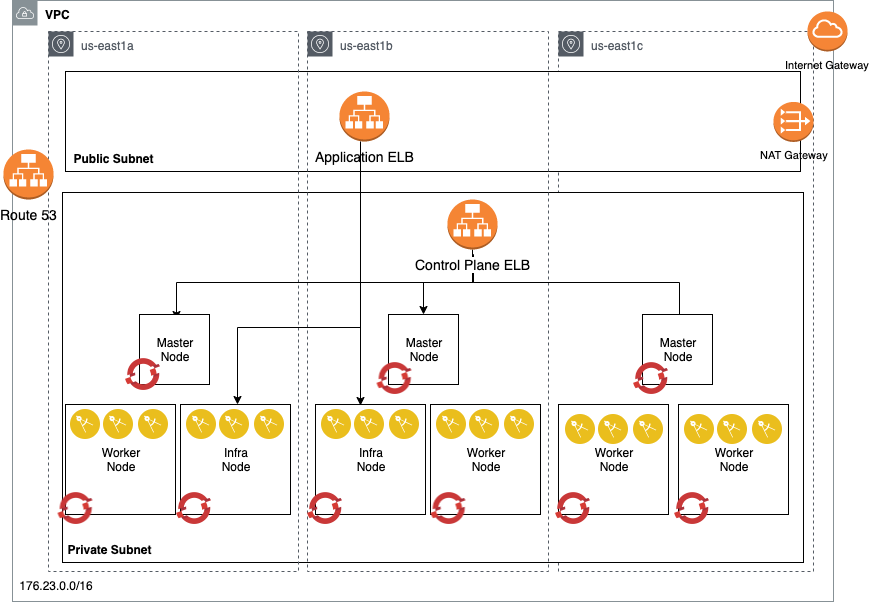

# Automated OpenShift v4 installation on AWS

This project automates the Red Hat Openshift Container Platform 4.2 installation on Amazon AWS platform. It focuses on the Openshift User-provided infrastructure installation (UPI) where end users provide pre-existing infrastructure including VMs, networking, load balancers, DNS configuration etc.

* [Infrastructure Architecture](#infrastructure-architecture)
* [Terraform Automation](#terraform-automation)
* [Installation Procedure](#installation-procedure)
* [Cluster access](#cluster-access)
* [AWS Cloud Provider](#aws-cloud-provider)


## Infrastructure Architecture

For detail on OpenShift UPI, please reference the following:


* [https://docs.openshift.com/container-platform/4.2/installing/installing_aws_user_infra/installing-aws-user-infra.html](https://docs.openshift.com/container-platform/4.2/installing/installing_aws_user_infra/installing-aws-user-infra.html)
* [https://github.com/openshift/installer/blob/master/docs/user/aws/install_upi.md](https://github.com/openshift/installer/blob/master/docs/user/aws/install_upi.md)


The following diagram outlines the infrastructure architecture.


## Terraform Automation

This project uses mainly Terraform as infrastructure management and installation automation driver. All the user provisioned resource are created via the terraform scripts in this project.

### Prerequisites

1. To use Terraform automation, download the Terraform binaries [here](https://www.terraform.io/).


   We recommend to run Terraform automation from an AWS bastion host because the installation will place the entire OpenShift cluster in a private network where you might not have easy access to validate the cluster installation from your laptop.

   Provision an EC2 bastion instance (with public and private subnets).
   Install Terraform binary.
   Install git
   Install tree 
   

   ```bash
   sudo yum install git-all
   git --version
   ```
```bash
   sudo yum install tree
 ```

   Install OpenShift command line `oc` cli:

   ```bash
   wget https://mirror.openshift.com/pub/openshift-v4/clients/ocp/latest/openshift-client-linux-4.2.14.tar.gz
   tar -xvf openshift-client-linux-4.2.14.tar.gz
   chmod u+x oc kubectl
   sudo mv oc /usr/local/bin
   sudo mv kubectl /usr/local/bin
   oc version
   
   wget https://mirror.openshift.com/pub/openshift-v4/clients/ocp/latest/openshift-install-linux-4.2.14.tar.gz
   tar -xvf openshift-install-linux-4.2.14.tar.gz
   chmod u+x openshift-install
   sudo mv openshift-install /usr/local/bin
    ```

   You'll also need the [AWS CLI](https://docs.aws.amazon.com/cli/latest/userguide/awscli-install-bundle.html) to do this.

2. Get the Terraform code

   ```bash
   git clone https://github.com/praveenmail2him/terraform_scripts_openshift_4_aws.git
   ```

3. Prepare the DNS

   OpenShift requires a valid DNS doamin, you can get one from AWS Route53 or using existing domain and registrar.
   
   ```DNS Name
    ocp4os.com
   ```

4. Prepare AWS Account Access

   Please reference the [Required AWS Infrastructure components](https://docs.openshift.com/container-platform/4.2/installing/installing_aws_user_infra/installing-aws-user-infra.html#installation-aws-user-infra-requirements_installing-aws-user-infra) to setup your AWS account before installing OpenShift 4. This step is very important.

   We suggest to create an AWS IAM user dedicated for OpenShift installation with permissions documented above.
   On the bastion host, configure your AWS user credential as environment variables:

    ```bash
    export AWS_ACCESS_KEY_ID=RKXXXXXXXXXXXXXXX
    export AWS_SECRET_ACCESS_KEY=LXXXXXXXXXXXXXXXXXX/ng
    export AWS_DEFAULT_REGION=us-east-2

    aws s3 ls
   ```
5. Install: User Provided Infrastructure (UPI) - This Step is bigger.

The steps for performing a UPI-based install are outlined here.

## Create Configuration

Create an install configuration as for [the usual approach - IPI Installation (which is not recommended here)](install.md#create-configuration):

```console
$ openshift-install create install-config
? SSH Public Key /home/user_id/.ssh/id_rsa.pub
? Platform aws
? Region us-east-2
? Base Domain ocp4os.com
? Cluster Name openshift
? Pull Secret [? for help]
```

### Optional: Create Encrypted AMIs - This step is FYI only can be ommitted.

The IPI-based installer creates an encrypted AMI by default. If you wish to have an encrypted AMI for UPI-based
installs, you will need to create it directly. You can find a list of the appropriate base AMIs 
[here](../../../data/data/rhcos.json).

You will make an encrypted copy of the AMI according to the [AWS documentation][encrypted-copy].

With the new AMI, you can [customize](customization.md) the install-config created on the previous step to override
the default. Additionally, you would pass it to the templates or EC2 launch instance commands according to how
you intend to launch your hosts.

### Empty Compute Pools

We'll be providing the control-plane and compute machines ourselves, so edit the resulting `install-config.yaml` to set `replicas` to 0 for the `compute` pool:

```sh
python -c '
import yaml;
path = "install-config.yaml";
data = yaml.load(open(path));
data["compute"][0]["replicas"] = 0;
open(path, "w").write(yaml.dump(data, default_flow_style=False))'
```

## Edit Manifests

Use [a staged install](../overview.md#multiple-invocations) to make some adjustments which are not exposed via the install configuration.

```console
$ openshift-install create manifests
INFO Consuming "Install Config" from target directory
```

### Remove Machines and MachineSets

Remove the control-plane Machines and compute MachineSets, because we'll be providing those ourselves and don't want to involve [the machine-API operator][machine-api-operator]:

```console
$ rm -f openshift/99_openshift-cluster-api_master-machines-*.yaml openshift/99_openshift-cluster-api_worker-machineset-*.yaml
```

You are free to leave the compute MachineSets in if you want to create compute machines via the machine API, but if you do you may need to update the various references (`subnet`, etc.) to match your environment.

### Make control-plane nodes unschedulable

Currently [emptying the compute pools](#empty-compute-pools) makes control-plane nodes schedulable.
But due to a [Kubernetes limitation][kubernetes-service-load-balancers-exclude-masters], router pods running on control-plane nodes will not be reachable by the ingress load balancer.
Update the scheduler configuration to keep router pods and other workloads off the control-plane nodes:

```sh
python -c '
import yaml;
path = "manifests/cluster-scheduler-02-config.yml"
data = yaml.load(open(path));
data["spec"]["mastersSchedulable"] = False;
open(path, "w").write(yaml.dump(data, default_flow_style=False))'
```

## Create Ignition Configs

Now we can create the bootstrap Ignition configs:

```console
$ openshift-install create ignition-configs
```

After running the command, several files will be available in the directory.

```console
$ tree
.
├── auth
│   └── kubeconfig
├── bootstrap.ign
├── master.ign
├── metadata.json
└── worker.ign
```

### Extract Infrastructure Name from Ignition Metadata

Many of the operators and functions within OpenShift rely on tagging AWS resources. By default, Ignition
generates a unique cluster identifier comprised of the cluster name specified during the invocation of the installer
and a short string known internally as the infrastructure name. These values are seeded in the initial manifests within
the Ignition configuration. To use the output of the default, generated
`ignition-configs` extracting the internal infrastructure name is necessary.

An example of a way to get this is below:

```
$ jq -r .infraID metadata.json
openshift-vw9j6
```


## Installation Procedure

This project installs the OpenShift 4 in several stages where each stage automates the provisioning of different components from infrastructure to OpenShift installation. The design is to provide the flexibility of different topology and infrastructure requirement.

1. The deployment assumes that you run the terraform deployment from a Linux based environment. This can be performed on an AWS-linux2 EC2 instance. The deployment machine has the following requirements:

    - git cli
    - terraform 0.12 or later
    - aws client
    - jq command (Optional) 
    - wget command
    - tree command

2. Deploy the private network and OpenShift 4 cluster through the connection using transit gateway to the public environment.
   You can use all the automation in a single deployment or you can use the individual folder in the git repository sequentially. The folders are:

 	- 1_vpc_configuration: Create the VPC and subnets for the OpenShift cluster
	- 2_load_balancer_configuration: Create the system loadbalancer for the API and machine config operator
	- 3_dns_configuration: generate a private hosted zone using route 53
	- 4_security_group_configuration: defines network access rules for masters and workers
	- 5_iam_configuration: define AWS authorities for the masters and workers
	- 6_bootstrap_ignition_configuration: main module to provision the bootstrap node and generates OpenShift installation files and resources
	- 7_control_plane_RHCS_configuration: create master nodes manually (UPI)
	- 8_postinstall_operations: defines public DNS for application load balancer (optional)

	You can also provision all the components in a single terraform main module, to do that, you need to use a terraform.tfvars, that is copied from the terraform.tfvars.example file. The variables related to that are:

	Create a `terraform.tfvars` file with following content:

  ```
  aws_region = "us-east-2"
  aws_azs = ["a", "b", "c"]
  default_tags = { "owner" = "ocp42" }
  infrastructure_id = "ocp42"
  clustername = "ocp4"
  domain = "ocp4os.com"
  ami = "ami-0bc59aaa7363b805d"
  aws_access_key_id = ""
  aws_secret_access_key = ""
  bootstrap = { type = "i3.xlarge" }
  control_plane = { count = "3" , type = "m4.xlarge", disk = "120" }
  use_worker_machinesets = true
  # worker = {        count = "3" , type = "m4.large" , disk = "120" }
  openshift_pull_secret = "./openshift_pull_secret.json"
  openshift_installer_url = "https://mirror.openshift.com/pub/openshift-v4/clients/ocp/latest"
  ```

|name | required                        | description and value        |
|----------------|------------|--------------|
| `aws_region`   | no           | AWS region that the VPC will be created in.  By default, uses `us-east-2`.  Note that for an HA installation, the AWS selected region should have at least 3 availability zones. |
| `aws_azs`          | no           | AWS Availability Zones that the VPC will be created in, e.g. `[ "a", "b", "c"]` to install in three availability zones.  By default, uses `["a", "b", "c"]`.  Note that the AWS selected region should have at least 3 availability zones for high availability.  Setting to a single availability zone will disable high availability and not provision EFS, in this case, reduce the number of master and proxy nodes to 1. |
| `default_tags`     | no          | AWS tag to identify a resource for example owner:gchen     |
| `infrastructure_id` | yes | This id will be prefixed to all the AWS infrastructure resources provisioned with the script - typically using the clustername as its prefix.  |
| `clustername`     | yes          | The name of the OpenShift cluster you will install     |
| `domain` | yes | The domain that has been created in Route53 public hosted zone |
| `ami` | no | Red Hat CoreOS ami for your region (see https://docs.openshift.com/container-platform/4.2/installing/installing_aws_user_infra/installing-aws-user-infra.html). |
| `aws_secret_access_key` | yes | adding aws_secret_access_key to the cluster |
| `aws_access_key_id` | yes | adding aws_access_key_id to the cluster |
| `bootstrap` | no | |
| `control_plane` | no | |
| `use_worker_machinesets` | no | if set to true, then workers are created using machinesets otherwise use the worker variable |
| `worker` | no | if not using the machinesets, this variable is used to size the worker machines |
| `openshift_pull_secret` | no | The value refers to a file name that contain downloaded pull secret from https://cloud.redhat.com/openshift/install; the default name is `openshift_pull_secret.json` |
| `openshift_installer_url` | no | The URL to the download site for Red Hat OpenShift installation and client codes.  |
| `private_vpc_cidr`     | no          | VPC private netwrok CIDR range default 10.10.0.0/16  |
| `vpc_private_subnet_cidrs`     | no          | CIDR range for the VPC private subnets default ["10.10.10.0/24", "10.10.11.0/24", "10.10.12.0/24" ]   |
| `vpc_public_subnet_cidrs` | no | default to ["10.10.20.0/24","10.10.21.0/24","10.10.22.0/24"] |
| `cluster_network_cidr` | no | The pod network CIDR, default to "192.168.0.0/17" |
| `cluster_network_host_prefix` | no | The prefix for the pod network, default to "23" |
| `service_network_cidr` | no | The service network CIDR, default to "192.168.128.0/24" |


See [Terraform documentation](https://www.terraform.io/intro/getting-started/variables.html) for the format of this file.


Initialize the Terraform:

```bash
terraform init
```
Recommended Installation
You navigate to the Individual folder (Modules) and perform these operations for better understanding and debugging.

```bash
[ec2-user@ip-172-31-13-179 1_vpc_configuration]$ terraform init
[ec2-user@ip-172-31-13-179 1_vpc_configuration]$ terraform plan
[ec2-user@ip-172-31-13-179 1_vpc_configuration]$ terraform apply

```
You can take the Output values of each module and apply to your prompts to you next module, for example like this
```bash
aws_route.ocp_pri_net_route_ngw[2]: Creation complete after 2s [id=r-rtb-05621326f0a3192b11080289494]
aws_vpc_endpoint.private_ec2: Creation complete after 1m53s [id=vpce-0c2ea2a7ee4cce9e2]

Apply complete! Resources: 41 added, 0 changed, 0 destroyed.

Outputs:

clustername = ocp4
infrastructure_id = ocp4-f0f9
private_vpc_id = vpc-0721cc2575910c2d6
private_vpc_private_subnet_ids = [
  "subnet-03ed5a72f6a970bce",
  "subnet-03d0f5de0e38e725a",
  "subnet-00e5ca4992f240cfd",
]
private_vpc_public_subnet_ids = [
  "subnet-0c8d33e59b9e03428",
  "subnet-089e52102cf02ac81",
  "subnet-0822245d745c93d8a",
]
[ec2-user@ip-172-31-13-179 2_load_balancer_configuration]$terraform init

[ec2-user@ip-172-31-13-179 2_load_balancer_configuration]$ terraform plan
var.private_vpc_id
  Enter a value: vpc-0721cc2575910c2d6

var.private_vpc_private_subnet_ids
  List of subnet ids
  Enter a value: ["subnet-03ed5a72f6a970bce","subnet-03d0f5de0e38e725a","subnet-00e5ca4992f240cfd"]
  
[ec2-user@ip-172-31-13-179 2_load_balancer_configuration]$ terraform apply

```


Run the terraform provisioning:

```bash
terraform plan
terraform apply
```
